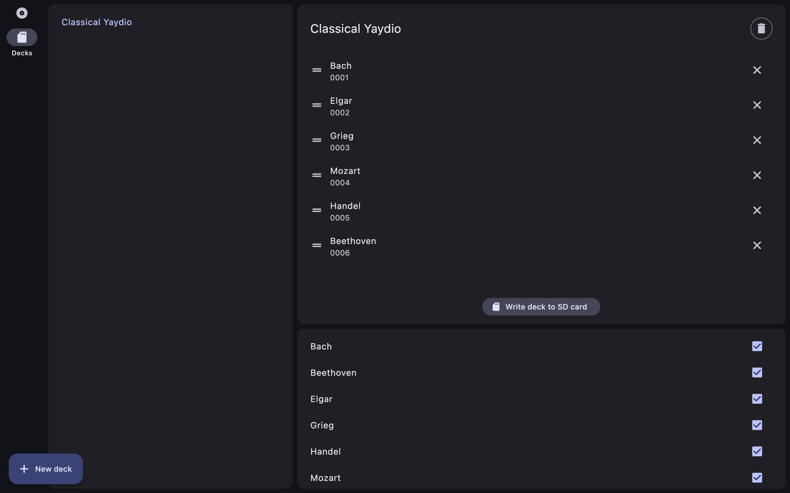

# Yaydio SD Flash

A cross-platform desktop utility for preparing SD cards compatible with
[Yaydios](https://github.com/JakesMD/Yaydio) and other hardware utilizing
DY-XXXX sound modules.

## ✨ Features

- **Intuitive Organization:** Drag and drop MP3 albums and rearrange tracks with
  a visual interface.
- **Deck Management:** Create multiple "Decks," assign specific albums to them,
  and set the playback hierarchy.
- **Sequential Writing:** Automatically handles the "File Table" ordering
  required by budget audio hardware.
- **macOS Optimization:** Automatically performs a dot_clean and immediate
  unmount to prevent hidden metadata files (like ._001.mp3) from interfering
  with playback.

## 🛠 Why This Exists

Cheap sound modules often lack the processing power to sort files by name or
metadata. Instead, they play files based on their index in the Physical File
Table (the order in which they were written to the disk).

Standard file explorers often copy files in parallel or in an arbitrary order,
which causes albums to play out of sequence.

## 📦 Installation

Downloads for all platforms are available on the
[Releases](https://github.com/JakesMD/Yaydio-SD-Flash/releases) page.

As the app is currently unsigned on macOS, you may need to **Right-Click >
Open** or go to **System Settings > Privacy & Security** to allow the
application to run.

## 🤝 Contributing

Contributions, issues, and feature requests are welcome!
